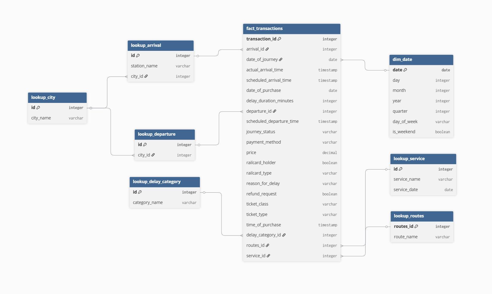
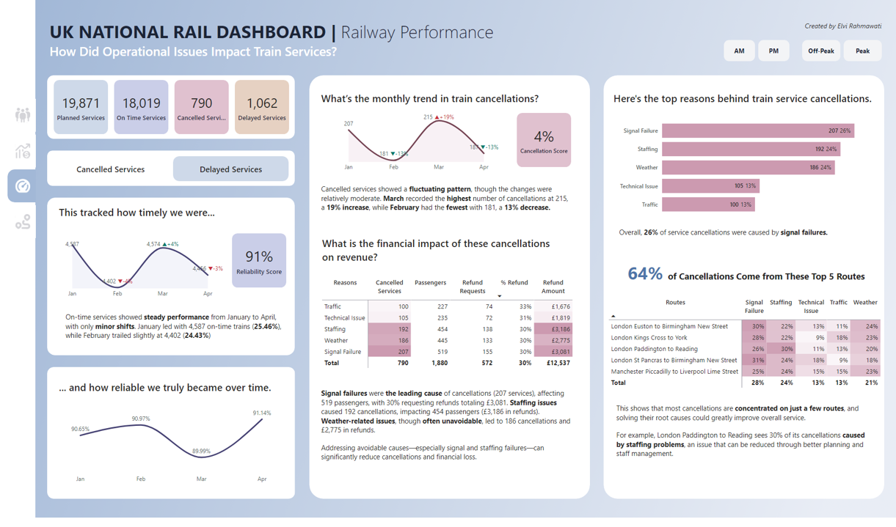
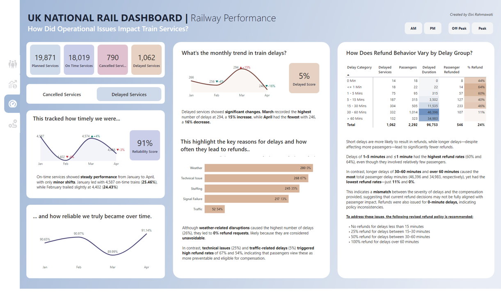
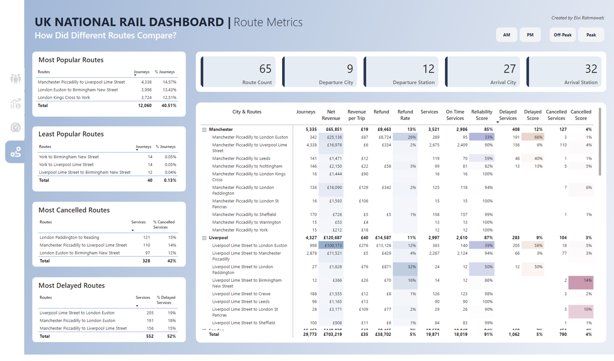

# UK National Railway Performance Analysis — Nextrail Ltd.

Table of Contents

- [Project Background](#project-background)
- [Dataset Structure](#dataset-structure)
- [Executive Summary](#executive-summary)
- [Insights Deep-Dive](#insights-deep-dive)
  - [Passenger Overview](#passenger-overview)
  - [Sales Analytics](#sales-analytics)
  - [Railway Performance](#railway-performance)
  - [Route Metrics](#route-metrics)
- [Recommendations](#recommendations)
  - [Passenger Overview](#passenger-overview-1)
  - [Sales Analytics](#sales-analytics-1)
  - [Railway Performance](#railway-performance-1)
  - [Route Metrics](#route-metrics-1)
- [Clarifying Questions, Assumptions, and Caveats](#clarifying-questions-assumptions-and-caveats)

---

## PROJECT BACKGROUND

Nextrail Ltd. is a national company overseeing railway operations and passenger analytics across England, Scotland, and Wales. The company works closely with multiple train operators to ensure seamless travel experiences and efficient nationwide rail service.

As a Business Intelligence Developer, I was assigned to the Data Insights & Planning team to develop a detailed exploratory dashboard. The KPIs we investigated include the following specific metrics, which are used by multiple teams including:

- _Passenger travel patterns_, including peak-hour trends, class preferences, and station traffic, enabling the **Marketing Team** to launch targeted campaigns, promote railcard usage, and optimize commuter engagement.
- _Sales and revenue composition_ by ticket type (Advance, Anytime), travel class (Standard, First Class), and city-level performance, supporting the **Finance and Product Teams** in adjusting pricing strategies and addressing shifts in passenger demand.
- _Delay and refund dynamics_, highlighting the disproportionate financial impact of short delays versus cancellations, allowing **Operations and Customer Service Teams** to improve reliability and revise refund policies based on actual passenger impact.
- _Route-level demand and performance_, identifying high-traffic routes, underutilized corridors, and cancellation/delay concentrations, helping the **Operations Team** plan resource allocation and scheduling more efficiently.

## DATASET STRUCTURE

This project uses a transactional train dataset from January to April 2024, containing 31,653 records with 18 fields across 7 structured tables:  
- `fact_transaction`,  
- `lookup_city`,  
- `lookup_arrival`,  
- `lookup_departure`,  
- `lookup_delay_category`,  
- `dim_date`,  
- `lookup_service`,  
- and `lookup_routes`.

Each table has a defined primary key and includes various data types, such as `varchar` for text fields, `date` for calendar dates, and `timestamp` for scheduled or actual times.

The core table, `fact_transaction`, uses `transaction_id` as a unique identifier for each record and captures key operational events such as ticket purchases, scheduled vs. actual arrival times, and delay durations. It is linked to six dimensions tables via foreign keys: `arrival_id`, `departure_id`, `delay_category_id`, `journey_id`, `service_id`, and `date_of_journey`. These relationships are defined as one-to-many, meaning a single record in a lookup table can be referenced by multiple records in the transaction table.

  

## EXECUTIVE SUMMARY

Between January and April 2024, total journeys dropped 4.36%, yet peak-hour trips remained vital driving 61% of revenue. February saw a 20% revenue dip due to a shift from premium to cheaper ticket types. Delays had a higher financial impact than cancellations, with short delays triggering the most refunds. Weather delays though most frequent resulted in no refunds. Most cancellations were avoidable, concentrated on just five routes, and mainly caused by signal failures and staffing issues.

## INSIGHTS DEEP-DIVE

### PASSENGER OVERVIEW

  

- Between January and April 2024, there were a total of 29,773 passenger rail succesful journeys. January recorded the highest number, while February had the lowest. As a result, passenger journeys declined by -4.36 % over this period.  
- 2/3 of passengers do not use a railcard. Among holders, the Adult Railcard is most used, despite 1/3 fare discounts.  
- Standard Class dominates with 90% of all tickets, and within this class, Advance tickets are the most popular (14,865 journeys / 55%).  
- There are two peak hours during the day: AM peak from 6:00 AM to 8:59 AM and PM peak from 4:00 PM to 6:59 PM, mainly driven by work commutes.  
- During the morning peak, the highest number of journeys (18%) occurs at 6:30 AM, while during the evening peak, 30% of journeys take place at 6:45 PM.  
- Manchester Piccadilly is the busiest departure station (18%) with peak departures at 5:45 PM, while Birmingham New Street is the busiest arrival station (24%) with peak arrivals at 8:05 PM.

### SALES ANALYTICS

  

- Net revenue peaked in January, dropped by 20% in February, then rebounded by 22% in March—indicating seasonal shifts  
- 61% of total revenue comes from peak-hour journeys, confirming their critical role in revenue generation.  
- February’s 40% rise in Advance sales couldn’t offset a 20% revenue drop, driven by steep declines in premium tickets indicating a shift toward cheaper options.  
- On-time journeys drive 81% of revenue, while delays and cancellations limit revenue potential to under 20% revealing lost earning opportunities.  
- 68% of total refunds (£26,165) are due to delays, not cancellations (32%), indicating delays have a higher financial impact.  
- Shorter delays often trigger higher refund rates, with <1 min delays having the highest at 76%. In contrast, longer delays show significantly lower refund impact, with 30-60 minute delays at just 2% and delays over 60 minutes at 0%  
- The London Kings Cross to York route generates the highest revenue. However, despite its profitability, it is not the most traveled route. Instead, the Manchester Piccadilly to Liverpool Lime Street route ranks as the most popular out of 64 routes.  
- London generates the highest revenue with a low refund rate (2%), making it the most financially efficient city hub.  

### RAILWAY PERFORMANCE

**On-Time Services**  
- 91% of the 19,871 services ran on time, with minor monthly shifts—peaking in January and lowest in February.  

**Cancelled Services**  

  

- 4% of services were cancelled, with fluctuations. March had the highest (215, +19%) and February the lowest (181, −13%).  
- Overall, 26% of service cancellations were caused by signal failures.  
- On average, 30% of passengers affected by cancellations requested refunds, resulting in a financial loss of £12,537. Notably, the top reasons which are signal failure and staffing issues are largely avoidable, unlike weather-related disruptions, which are often unavoidable.  
- 64% of cancellations are concentrated on the top 5 routes  

**Delayed Services**  

  

- Delayed services accounted for 5%, with March seeing the highest (294 delays, +15%) and April the lowest (246 delays, −16%).  
- Weather-related delays were most common (26%), but led to 0% refunds, likely due to their unavoidable nature.  
- Technical issues (25%) and traffic delays (5%) triggered high refund rates—67% and 54%, showing passengers expect compensation for avoidable issues.  
- Short delays (≤1 min, 15 min) had the highest refund rates (64% and 60%) despite affecting fewer passengers.  
- Longer delays (30–60 min and >60 min) caused the most passengers yet had lowest refund rates (11% and 0%).  
- Refunds were issued for 0-minute delays, suggesting policy inconsistencies and misalignment between impact and compensation.  

### ROUTE METRICS

  

- There are 65 unique routes, spanning 9 departure cities, 12 departure stations, 27 arrival cities, and 32 arrival stations.  
- 41% of all journeys come from the top 3 routes, with the most popular being Manchester Piccadilly to Liverpool Lime Street, accounting for 15% of total journeys.  
- The least popular route is York to Birmingham New Street, making up just 0.05% of journeys.  
- The route with the most cancellations is London Paddington to Reading, representing 15% of all cancelled services.  
- The route with the most delays is Liverpool Lime Street to London Euston, accounting for 19% of all delayed services.  

## RECOMMENDATIONS

### Passenger Overview

- Increase awareness of railcard benefits to boost adoption, as 2 out of 3 passengers don’t use a railcard despite saving 1/3 on fares.  
- Optimize the ticket mix strategy, given that 90% of passengers choose Standard Class, and 55% prefer Advance tickets—which offer up to 50% off but must be purchased at least a day before departure.  
- Operations Team should adjust train frequency and capacity during peak hours (AM: 6:00–8:59 AM, PM: 4:00–6:59 PM) to accommodate commuter surges and manage Anytime ticket usage, which is valid at all times.  
- Enhance passenger handling and staffing at Manchester Piccadilly (18%) and Birmingham New Street (24%), the two busiest stations during evening travel times.  

### Sales Analytics

- Marketing Team should launch targeted February campaigns that emphasize both affordability and value, addressing the 20% revenue decline. These efforts should focus on recapturing higher-yield segments while still appealing to price-sensitive passengers during the low-demand period.
- Operations Team must strengthen peak-hour capacity and reliability to mitigate the risk of overdependence on peak-period revenue (61%).  
- Product Team must adjust ticket pricing to address shifting demand toward cheaper Advance tickets, which drove February’s 6% revenue decline.  
- Prioritize delay reduction strategies to tackle refund losses, as 68% of refunds are triggered by late arrivals.  
- Replicate London’s efficiency model across other cities to improve overall profitability and reduce refund rates.  

### RAILWAY PERFORMANCE

- Operations Team must prioritize route-level planning and address avoidable issues like signal and staffing failures, since 64% of cancellations are concentrated on just 5 routes and largely stem from preventable causes.  
- Product Team must refine refund policies to better reflect real passenger impact, since current patterns show high refunds for short delays while severe delays—despite clear disruption—often go uncompensated.  

**To address these issues, the following revised refund policy is recommended:**  
- No refunds for delays less than 15 minutes  
- 25% refund for delays between 15–30 minutes  
- 50% refund for delays between 30–60 minutes  
- 100% refund for delays over 60 minutes  

### ROUTE METRICS

- Product team must optimize scheduling and capacity on top routes like Manchester Piccadilly–Liverpool Lime Street since they drive 15% of total journeys.  
- Marketing team must launch targeted campaigns or bundled ticket incentives for the York–Birmingham New Street route since its usage is critically low (0.05%), indicating untapped market potential.  

## CLARIFYING QUESTIONS, ASSUMPTIONS, AND CAVEATS

**KEY QUESTIONS FOR STAKEHOLDERS PRIOR TO PROJECT ADVANCEMENT**

**ASSUMPTIONS & CAVEATS**

